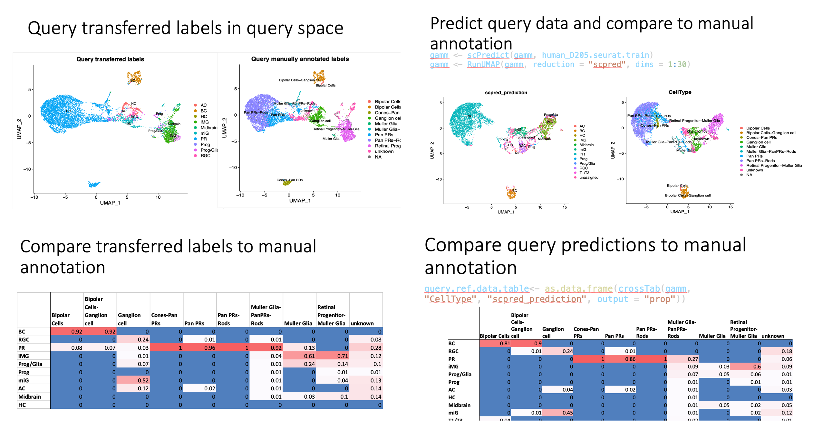

# Cross species predictions of cell types of pig retinal organoid data from human reference.

# Abstract

Retinal degenerative diseases and injury leading to irreversible loss of 
outer retinal photoreceptor cells are common causes of blindness worldwide. 
Mammals, including humans, lack the innate capacity to regenerate 
photoreceptors; therefore, in an injury or disease state where the cells are 
lost, it is necessary to replace or bypass the lost cells. Pig eyes are very 
similar to the human eye in that they are both diurnal which results in a high 
density of cone photoreceptors, they both have a similar eye size, and they 
have a similar distribution of retinal layers. Here we have generated retinal 
organoids from pig pluripotent stem cells for pig-into-pig allograft studies to 
test whether these cells are able to connect to the pig host retina. This will 
serve as a proof of concept for future human-to-human transplants. Our aim 
is to see how closely the pig retinal organoid resembles the human retina in 
cell types, and whether we obtained photoreceptors that are capable of 
transplantation. We used a human retinal organoid as a reference to 
compare to and annotate our pig retinal organoid. Using various prediction 
methods including scPred and Seurat mapping, we found that photoreceptor 
cells and bipolar cells were very similar across species and developmental 
stage, with both methods predicting with high probability around 90-100% of
photoreceptors correctly and 80-90% of bipolar cells correctly when 
compared to our manual annotation. Muller glia cell types were predicted 
with about 60-70% agreement to our manual annotation using Seurat 
mapping. In contrast, both methods predicted ganglion cells poorly, with only
about 25% agreement with our manual annotation. The retinal progenitor, 
amacrine, and horizontal cell types were also not predicted well or at all in 
pig. This highlights potential differences between the species or differing 
developmental stages for these cell type

# Results

## cell type predictions: scPred vs Seurat mapping

- bipolar and photoreceptors predicted well by both scPred and Seurat mapping.
- Muller glia cells predicted better by seurat mapping
- both predicted majority of ganglion cells as microglia
- amacrine, horizontal, midbrain and progentior cells not predicted in pig
``` {r, echo=FALSE}
source("paper.R")
make_figure_1()
```
```{r, echo=FALSE, out.width='100%'} 
# , out.height='80%'

```
figure caption: Figure 1 compares scPred and Seurat Mapping predictions
A. umap of scpred prediction vs manual annotation
B. umap of seurat mapping prediciton vs manual
C. table of scpred prediction vs manual
D. table of seurat mapping prediciton vs manual

# Discussion

# Conclusions

# Methods

## Data
We are using pig and human data.

- pig data is from Gamm lab
    - sample 1 is retinal organoid from day XX
    - sample 2 is retinal organoid from day 125
    - each sample was run on two flow cell lanes for technical replicates
- human data is from Reh 2020, GSE142526
    - one sample from human retinal organoid day 205
    - run on four flow cell lanes
- TODO Get more Data
    - Cowan
    - ?
    - Mouse ?


## Star solo
To map the reads we used star solo

- Building the index
    - pig genome: Sus_scrofa_berkshire.Berkshire_pig_v1.109 from Ensemble
    - human genome: Homo_sapiens.GRCh38.108 from Ensemble
- Mapping
    - parameter choice guided by star solo documentation (Ref)
        - empty drops filtered
        - EM used for multimapping
        - 1 mismatch for UMI count allowed
    - TODO: output path and n threads

## Soup X
To normalize for ambient mRNA
- soup X
    - compare raw and filtered counts to estimate the amount of ambient mRNA. 
    - then adjust counts accordingly
- parameters are umap method and dimensions
- TODO: ? refactor (leverage run_umap code)

## Dbl Remover
To remove droplets that contain two or more cells

- Doublet Finder

## Mitochondrial gene filtering

## Normalization

## Feature selection